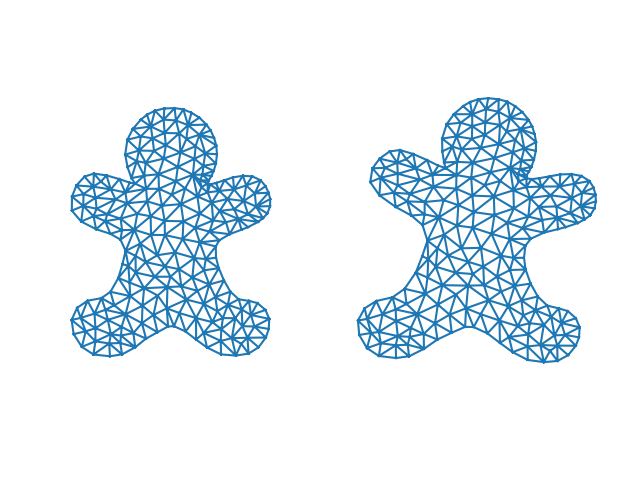
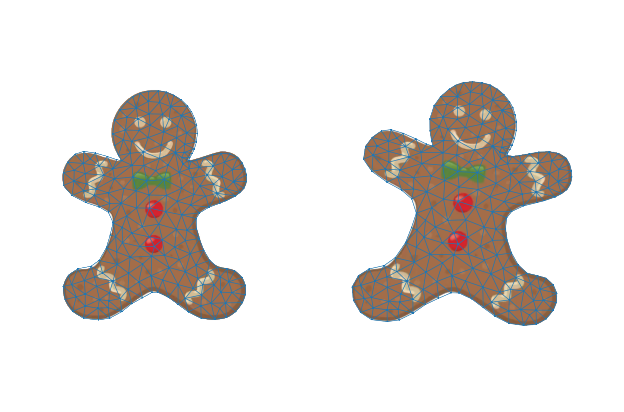
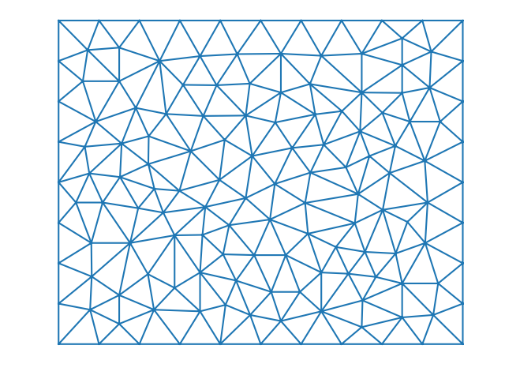
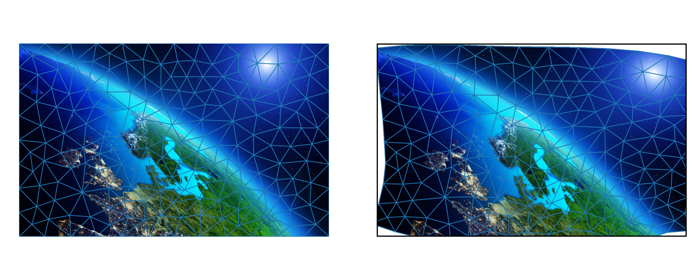

|GitHub version| |Licence GPLv3| |Python version| |OS|

.. |GitHub version| image:: https://img.shields.io/badge/version-0.4.dev0-yellow.svg

.. |Python version| image:: https://img.shields.io/badge/python-3.7|3.8|3.9|3.10|3.11|3.12-orange.svg

.. |Licence GPLv3| image:: https://img.shields.io/badge/license-GNU/GPLv3-blue.svg

.. |OS| image:: https://img.shields.io/badge/os-Linux|Windows-magenta.svg

Puppet Warp
-----------

The goal of the package `puppet-warp` is provide plug and play solution for image
transformation similar to Adobe Photoshop `Puppet Warp` tool. Since Photoshop
solution is proprietary, hence any scripting might be a big issues especially in
environments where Photoshop is not supported, I decided to create this package based
on Python in which Puppet Warp is programmatically manageable and used in automation
processes where advanced transformation method is required.

Features
--------

- As-Rigid-as-Possible Shape Manipulation of triangular mesh
- Image transfer from triangualar mesh at rest to mesh defined by ARAP transformation

:note: I highly encourage you to report any issue. Feel free to create pull request.

Requirements
------------

::

    numpy>=1.21.5
    opencv-contrib-python>=4.5.4.60,<=4.11.0.86
    opencv-python>=4.5.4.60,<=4.11.0.86
    scikit-image>=0.19.2,<=0.25.1
    scikit-learn>=1.0.2,<=1.6.1

Optional::

    triangle>=20200424

Installation
~~~~~~~~~~~~

::

    pip install puppet-warp

For latest version from git, I recommend you to use::

    pip3 install git+https://github.com/mikecokina/puppet-warp.git@master

Install with `Jonathan Richard Shewchuk's` `(Dzhelil Rufat)` triangle::

    pip install puppet-warp[jrs]

Usage
~~~~~

Demo
====

The package puppet-warp is coming with live demo. To open lived demo, use following code.

.. code-block:: python

    from pwarp import Demo
    Demo().run()

To be able manipulate with image, select control points by clicking on vertices in
image (connections of edges). When points are chosen, take single points by cursor
and drag the point wherever you like.

Demo comes with capability to store transformed mesh. To save the mesh, hit **Space Bar**.
To quit demo, hit **Esc** button.

Custom demo
~~~~~~~~~~~

.. code-block:: python

    import cv2
    from pwarp import triangular_mesh, Demo
    from pwarp._io import save_wavefront

    # DEFINE WITHD and HEIGHT of your example image and DELTA step to create triangular mesh.
    width = 800
    height = 492
    delta = 100
    method = 'scipy'  # or jrs

    # DEFINE path to your image and path, where WAVEFRONT file will be stored.
    wavefront_path = "image.obj"
    image_path = "image.jpg"

    # noinspection PyUnresolvedReferences
    image = cv2.cvtColor(cv2.imread(image_path), cv2.COLOR_BGR2RGB)

    # This will genearete triangular mesh over the image with given
    r, f = triangular_mesh(width=width, height=height, delta=delta, method=method)
    # Save wavefront object.
    save_wavefront(wavefront_path, no_vertices=len(r), no_faces=len(f), vertices=r, faces=f)

    Demo(
        image=image_path,
        obj_path=wavefront_path,
        screen_height=height,
        screen_width=width,
        scale=1,
        dx=0,
        dy=0,
        verobse=True
    ).run()

Graph warp
==========

The graph warp requires vertices and faces (triangulation), control points and new displacement of
control points. Based on the given information, graph transform compute new positions of supplied
vertices.

**Example:**

.. code-block:: python

    from pwarp import get_default_puppet, graph_warp

    # Control points represent indices of points in original vertex array.
    control_pts = np.array([22, 50, 94, 106], dtype=int)
    # Shif represents new positions of control points respectively to `control_pts` list.
    shift = np.array(
        [[0.555, -0.905],
         [-0.965, -0.875],
         [-0.950, 0.460],
         [0.705, 0.285]], dtype=float
    )
    puppet = get_default_puppet()
    new_vertices = graph_warp(
        vertices=puppet.r,
        faces=puppet.f,
        control_indices=control_pts,
        shifted_locations=shift
    )

Graph defined warp
==================

The graph defined warp will transform areas of image covered by source vertices to given destination vertices.
An algorithm requires image, source and destination vertices, and faces for both. An order of faces (triangles) in
both sets have to be same, so in other words, source and destination faces must form pairs. A pixel in each
triangle is transformed via affine transformation defined by source to destination face.

**Example:**

.. code-block:: python

    import cv2
    from matplotlib import pyplot as plt
    from pwarp import graph_defined_warp, graph_warp, get_default_puppet

    control_pts = np.array([22, 50, 94, 106], dtype=int)
    shift = np.array(
        [[0.555, - 0.905],
         [-0.965, - 0.875],
         [-0.950, 0.460],
         [0.705, 0.285]], dtype=float
    )
    puppet = get_default_puppet()
    new_r = graph_warp(
        vertices=puppet.r,
        faces=puppet.f,
        control_indices=control_pts,
        shifted_locations=shift
    )

    image = cv2.cvtColor(cv2.imread("../data/puppet.png"), cv2.COLOR_BGR2RGB)
    width, height = 1280, 800
    dx, dy = int(width // 2), int(height // 2)
    scale_x, scale_y = 200, -200
    r = puppet.r.copy()
    r[:, 0] = r[:, 0] * scale_x + dx
    r[:, 1] = r[:, 1] * scale_y + dy

    new_r[:, 0] = new_r[:, 0] * scale_x + dx
    new_r[:, 1] = new_r[:, 1] * scale_y + dy

    image_t = graph_defined_warp(
        image,
        vertices_src=r,
        faces_src=puppet.f,
        vertices_dst=new_r,
        faces_dst=puppet.f
    )

    fig, axs = plt.subplots(1, 2, frameon=False)
    plt.tight_layout(pad=0)

    axs[0].imshow(image)
    axs[1].imshow(image_t)
    axs[0].triplot(r.T[0], r.T[1], puppet.f, lw=0.5)
    axs[1].triplot(new_r.T[0], new_r.T[1], puppet.f, lw=0.5)

    for ax in axs:
        ax.set_xlim([380, 900])
        ax.set_ylim([150, 750])
        ax.invert_yaxis()
        ax.axis('off')
    plt.show()

Triangular mesh
===============

The algorithm is intended to generate a triangular mesh within rectangle defined by its width and height.
The density of the mesh is adjustable via `delta` parameter. Algorithms is based on generation of frame. Frame
is defined by vertices where distance between each two vertices is defined by mentioned delta parameter.
The area of frame generated in such manner is triangulated.

Following example will generate mesh within rectangle of dimensions W x H = 1280 x 800 pixels.

**Example:**

.. code-block:: python

    from pwarp import triangular_mesh
    r, f = triangular_mesh(width=1280, height=800, delta=100)

**Example on full screen triangular mesh warp:**

References
----------

::

[1] https://www-ui.is.s.u-tokyo.ac.jp/~takeo/papers/takeo_jgt09_arapFlattening.pdf
[2] https://github.com/deliagander/ARAPShapeManipulation.git
[3] https://learnopencv.com/warp-one-triangle-to-another-using-opencv-c-python/
[4] https://rufat.be/triangle/
[5] http://www.cs.cmu.edu/~quake/triangle.html

Cite:
-----

::

    @article{journals/jgtools/IgarashiI09,
        author = {Igarashi, Takeo and Igarashi, Yuki},
        ee = {http://dx.doi.org/10.1080/2151237X.2009.10129273},
        journal = {J. Graphics, GPU, & Game Tools},
        number = 1,
        pages = {17-30},
        title = {Implementing As-Rigid-As-Possible Shape Manipulation and Surface Flattening.},
        url = {http://dblp.uni-trier.de/db/journals/jgtools/jgtools14.html#IgarashiI09},
        volume = 14,
        year = 2009
    }

or

::

    @article{10.1145/1073204.1073323,
        author = {Igarashi, Takeo and Moscovich, Tomer and Hughes, John F.},
        title = {As-Rigid-as-Possible Shape Manipulation},
        year = {2005},
        publisher = {Association for Computing Machinery},
        address = {New York, NY, USA},
        volume = {24},
        number = {3},
        doi = {10.1145/1073204.1073323},
        journal = {ACM Trans. Graph.},
        month = {jul},
        pages = {1134–1141},
        numpages = {8}
    }

